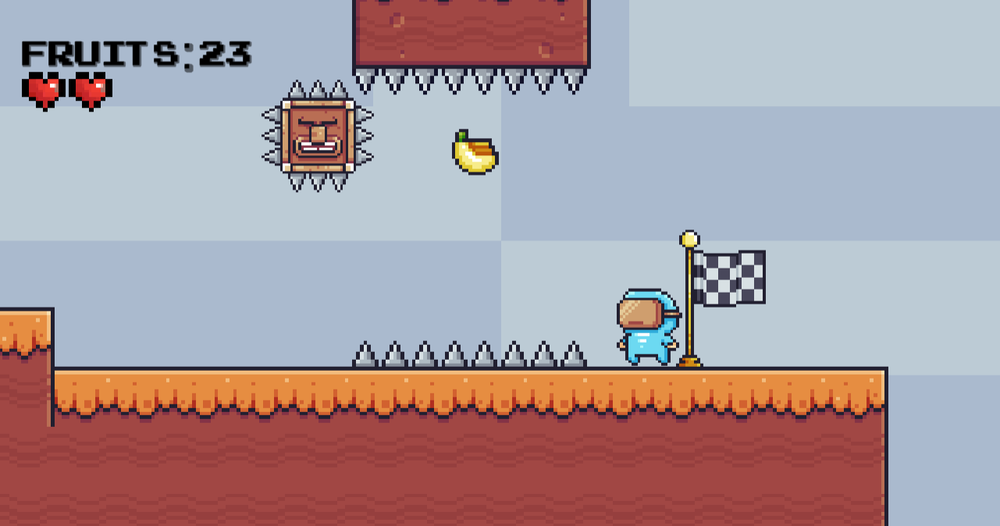
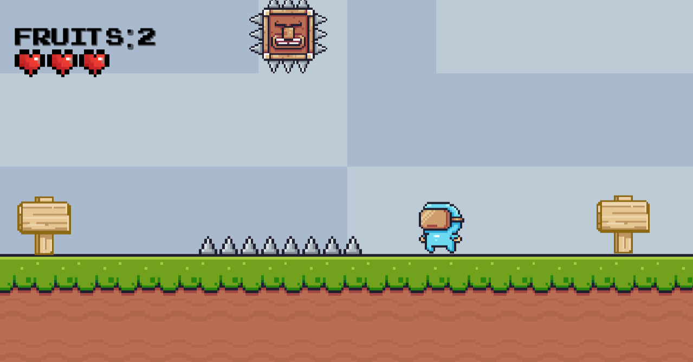

  
# How to play the game?

To run this game: 
 

* Accees the <a href="https://github.com/Yashmerino/J-E-T-P/releases">Releases</a> section and download the last version of the game.
* Right-click the zipped folder saved to your computer and choose "Extract All". Run the game and enjoy!

<h1 align="center"><strong>Demonstration</strong></h1>

<h1><strong>I made this small game using free assets, here are the credits:</strong></h1>

8 Bits Music Pack: https://destiny-knight.itch.io/free-8-bits-music-pack-2

200 Free SFX: https://kronbits.itch.io/freesfx

Heart Pack: https://gamedevelopershlok.itch.io/heartpack

371 Simple Buttons: https://assetstore.unity.com/packages/2d/gui/icons/371-simple-buttons-pack-97516

Pixel Adventure 1: https://assetstore.unity.com/packages/2d/characters/pixel-adventure-1-155360

<h1><strong>You can also play this game here:</strong></h1>  https://yashmerino.itch.io/jack-exploring-the-platformer
